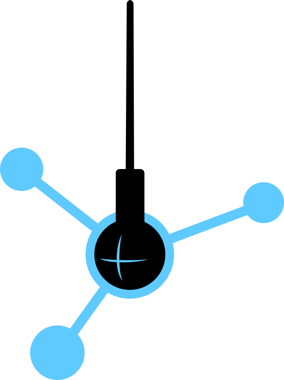

```{r setup, include=FALSE}
options(htmltools.dir.version = FALSE)
```

```{r fontawesome, include=FALSE} 
library(fontawesome)
```

```{r xaringan-themer, include=FALSE}
library(xaringanthemer)
mono_light(base_color = "#2c3e50", 
           header_font_google = google_font("Open Sans", "600"), 
           text_font_google   = google_font("Open Sans", "300", "300i"))
```

class: center, middle

## <font size='7'>"The job of the data scientist is to ask the right questions."</font> <br> <font size='5'>Hilary Mason <br> (Data scientist & founder of Fast Forward Labs)</font>

```{r, fig.align="center", echo=FALSE, out.width="250px"}

``` 

???

Image credit: [Story in a Bottle](http://storyinabottle.charmingrobot.com/2016/02/10/hilary-mason/)

---
class: inverse, center, middle

# What data science usually looks like...

---

## Image recognition

```{r, fig.align="center", echo=FALSE}
knitr::include_graphics("images/pug-image.png")
```

???

Image credit: [Pinterest](https://www.pinterest.com/pin/597571444276861714/)

---

## Recommender systems

```{r, fig.align="center", echo=FALSE}

```

---
class: center, middle

## <font size='9'>But there's more to it. We need to democratize the potential of data science.</font>

---

```{r, fig.align="center", echo=FALSE}

```

---
class: inverse, center, middle

# Data science for good <br> <font size='6'>(a.k.a. asking the right kind of questions)</font>


---

## Knowing your `r fa("questions", fill = "#2c3e50e")``r fa("question", fill = "#2c3e50e")``r fa("question", fill = "#2c3e50e")`

Using data science for social good requires **impact-based projects** built on **adequate data**.

But above all, we need the **expertise of social data scientists** who ask the following questions:

--

1. What impact do we want to have with our project? What is the target group?

--

2. What are the challenges and needs of the target group?

--

3. What kind of data is available and how can we access it?

--

4. What will our final product look like? How can we implement it technically?

--

5. Who uses the final product? How often? Which criteria must the product meet to truly add value? 

--

6. And last, but certainly not least: What can potentially go wrong? 💥

---
class: inverse, center, middle

# Harnessing the potential of data science

---

## [DataKind](https://www.datakind.org/): Home fire risk map

.pull-left[
- **Context:** The Home Fire Campaign by the American Red Cross aims to reduce the number of deaths and injuries caused by home fires

- **Objective:** Identify high-risk neighborhoods to target for in-home fire safety education and free smoke alarms

- **Approach:** Use ML techniques that leverage data from multiple sources to predict aggregate neighborhood home fire risk
]

.pull-right[

]

.center[
`r fa("home", fill = "#2c3e50e")` datakind.org  `r fa("twitter", fill = "#2c3e50e")` @DataKind  `r fa("facebook", fill = "#2c3e50e")` DataKindOrg
]

???

Link: [Home Fire Risk Map](https://home-fire-risk.github.io/smoke_alarm_map/)


---

## [CorrelAid](https://correlaid.org/): Online movements

.pull-left[
- **Context:** Social activist Ali Can launched the two hashtags #MeTwo and #We2 to draw attention to racial discrimination and multi-faceted racial identities

- **Objective:** Evaluate the content, key actors, and temporal dynamics of the Twitter campaigns to assess their potential and limitations

- **Approach:** Use NLP techniques and social network analysis to identify important topics and influential actors
]

.pull-right[

]

.center[
`r fa("home", fill = "#2c3e50e")` correlaid.org  `r fa("twitter", fill = "#2c3e50e")` @CorrelAid  `r fa("facebook", fill = "#2c3e50e")` WeAreCorrelAid
]

---

## [DSSG Berlin](https://dssg-berlin.org/): SchulePlus

.pull-left[
- **Context:** SchulePlus matches high school students with internships to help them figure out their professional future

- **Objective:** Understand the supply and demand for internships in the different states of Germany

- **Approach:** Correlate searches for internships with the job posts in the internship database
]

.pull-right[

]

.center[
`r fa("home", fill = "#2c3e50e")` dssg-berlin.org  `r fa("twitter", fill = "#2c3e50e")` @dssgber
]


---

## [Lecturers without Borders](https://scied.network/): Networks

.pull-left[
- **Context:** Lecturers without borders connects educational networks and scientists who use their travel opportunities to give free lectures to local students in developing countries

- **Objective:** Analyze how social initiatives are working together in different parts of the world

- **Approach:** Build database of schools which can host scientists
]

.pull-right[

]

.center[
`r fa("home", fill = "#2c3e50e")` scied.network  `r fa("twitter", fill = "#2c3e50e")` @NetworkScied  `r fa("facebook", fill = "#2c3e50e")` Lecturerswirthoutborders
]

---

## Want to become a social data scientist?

.pull-left[
```{r, fig.align="center", echo=FALSE}
knitr::include_graphics("images/correlaid-logo.png")
```
]

.pull-right[
```{r, fig.align="center", echo=FALSE, out.height="400px"}

```
]

---
class: center, middle

# Thanks!

Slides made with `r fa("heart", fill = "#2c3e50e")` and R [*xaringan*](https://github.com/yihui/xaringan).

Use cases by **[DataKind](https://www.datakind.org/)**, **[CorrelAid](https://correlaid.org/)**, **[DSSG Berlin](https://dssg-berlin.org/)**,<br> and **[Lecturers without Borders](https://sites.google.com/view/fellowshipresultsliubov/research-projects/lecturers-without-borders-researchers-mobility)**.
